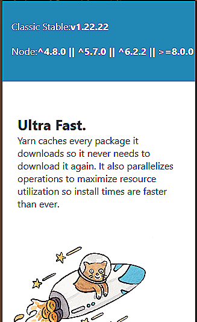
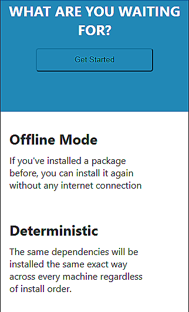
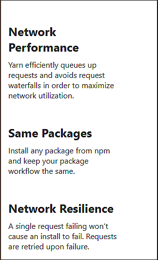

# Yarn Mobile Layout Clone

This project is a mobile-first clone of a modern web interface, designed to practice responsive layouts, Flexbox, and structured UI design. The focus was on building a clean, functional, and scalable layout suitable for small screens.

## Project Inspiration

The layout is inspired by the [Yarn Classic website](https://classic.yarnpkg.com)

It demonstrates multiple content sections including hero banners, feature highlights, call-to-action blocks, and footers, all stacked for mobile readability.

## Folder Structure

```bash
yarn-mobile-clone/
│
├── images/  
├── index.html
├── style.css 
└── README.md
```

## Source Code

[HTML Structure](./index.html): Organized sections for header, hero, features, call-to-action, and footer.

[CSS Styles](./style.css): Mobile-first styling with Flexbox for layout, consistent spacing using padding and margins, responsive images, and utility classes for alignment.

## Live Demo

You can view the deployed project here:

[](https://hadiashah01.github.io/yarn-classic-mobile-clone/)

## Coded Solution (Output)

The final result generated with HTML and CSS:  

  
  
  
  
  
  
 

## Purpose

The main goal of this project was to recreate a real-world mobile layout while mastering:

- **Responsive Flexbox Layouts**: Structuring nested rows and columns for mobile screens.

- **Content Alignment**: Using `justify-content, align-items`, and spacing for visually balanced sections.

- **Box Model Precision**: Leveraging `margin`, `padding`, and `border` to control spacing around elements.

- **Mobile-first Approach**: Designing for a 375px viewport, ensuring readability and proper stacking of components.


## Features Implemented

- **Header & Navigation:** Logo and menu button aligned with Flexbox.

- **Hero Section:** Centralized heading and call-to-action buttons.

- **Feature Highlights:** Multiple content blocks with images, headings, and descriptions.

- **Call-to-Action Section:** Prominent section prompting user interaction.

- **Footer:** Compact footer with aligned text links.


## Topics & Techniques


- **Nested Flex Containers:** Using `flex` inside other flex containers for complex layouts.

- **Clean & Maintainable CSS:** Utility classes for flex behavior, alignment, and spacing.

- **Mobile-first Design Strategy:** Focused on small screen usability while keeping structure consistent.

### Notes

- Fully HTML + CSS based, no external frameworks or JavaScript.

- Demonstrates practical skills in **responsive design, Flexbox, and mobile UI structuring**.
